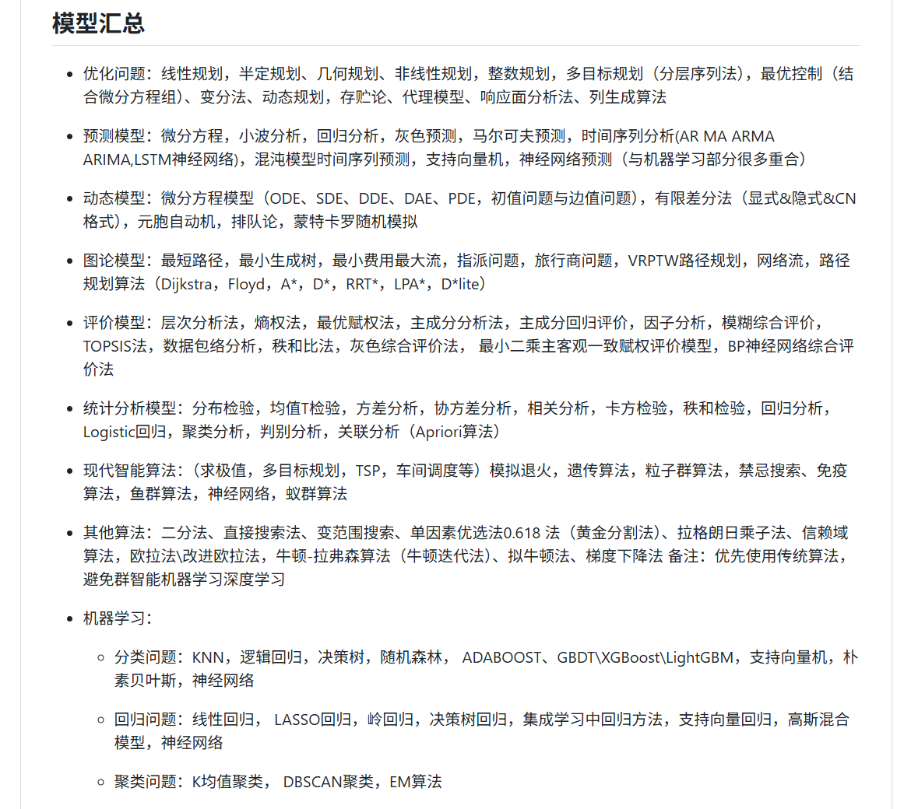

### Matlab说的队-2025华为杯数学建模备赛指南

## 备赛思路
- 数学建模竞赛主要分为：建模、编程、写作。其中编程最不重要（有现成代码和ai）、写作次要（优秀的排版和丰富的内容可以提高获奖率）、建模（最重要，直接决定论文质量）
- 所以还有最后的十一天，大家要以建模为主，多学习：
    - 模型/算法的类别（例如：预测、优化、分类、评价等）
    - 模型的作用（例如：提取特征、降维、计算相关性等）
    - 模型的基本原理（例如：step1、step2、step3...）
    - 模型的适用条件（例如：需要数据服从正态分布、模型需要通过xxx检验等）
    - 模型的使用方法是（例如：找一些实际例子看一下是如何实现的，以及使用什么方法实现）
    - 写作的方法（例如：使用word/latex写作、论文架构，多读往届优秀论文、摘要写法等）
    - 编程（不用怎么看，到时候主要用python，matlab也可以用）
    

## 备赛资料
- 国一（数模之星）仓库：https://github.com/DongZhouGu/MathModel-Pretrain/tree/master

- 总结仓库（建议大家看看建模算法部分）https://github.com/personqianduixue/Math_Model
https://github.com/zhanwen/MathModel

- 本文件夹中的：
    - D题-上海大学-答辩PPT.pptx
    - D题-上海大学-论文.pdf
    
        是之前的国一论文，可以从这个paper入手看一下写作的规范和格式，哪一章需要写什么，怎么写
    - 如果是数模小白，可以看下研究生数模国赛报告.pdf
    - 数学建模 四大模型总结.pdf

        可以看一下，这个也是模型的总结，下面这张图也是，大家一定要注意***模型积累的广度，而不是深度，知道什么时候要用什么模型，而不是知道模型的具体细节***，因为细节这些东西都很容易查得到或者有专门的软件来做。

        最后希望大家广泛阅读网上的资料，扩大自己的知识库，一起冲击更高奖项

